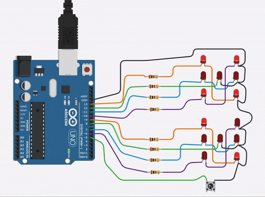

## Dice Game for Arduino

This is a code project for a hardware dice game on Arduino using LEDs to represent the sides of the dice.
There is a central button that when pressed "rolls" two dices that will output two random values after a simple animation routine.

Rolling example 1:

Rolling example 2:

